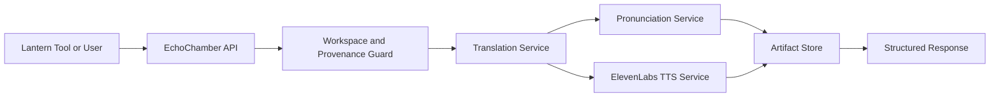

# EchoChamber Architecture

EchoChamber is the Lantern language and voice bridge. It accepts text or repo artifacts from Lantern tools, translates them into a target language, optionally generates pronunciation coaching, and can create ElevenLabs audio artifacts.

## System Role

EchoChamber is not the system-builder anymore. ETS, Christina, Lantern, SignalForge, and OpsHelm now cover the governance, orchestration, and operational layers. EchoChamber is the language layer those systems call when they need multilingual output.

## Primary Use Cases

1. Personal language learning, starting with Polish for Vanessa.
2. Tool-to-tool translation for Lantern repos.
3. Multilingual customer, guest, evidence, and content artifacts.
4. Voice generation through ElevenLabs.
5. Pronunciation lessons with phonetic hints and practice chunks.

## High-Level Flow

## Core Components

### API Layer

FastAPI endpoints expose translation, pronunciation, audio generation, language discovery, and contract inspection.

### Contract Layer

The `contracts/` folder defines JSON schemas, per-tool manifests, examples, and policy decisions. All tool integrations should be validated against these schemas before runtime use.

### Translation Service

Responsible for translating source text while preserving intent, tone, formatting, and domain context.

### Pronunciation Service

Generates phonetic hints, syllable-level practice chunks, Polish-specific character guidance, and learner notes.

### ElevenLabs Service

Generates speech from translated text and stores audio metadata with consent/provenance information.

### Artifact Store

Stores generated translations, lessons, and audio metadata. Audio storage starts local and can later move to Azure Blob Storage.

## Trust Boundaries

- Caller tools must provide provenance metadata.
- Workspace identifiers must travel with every request.
- Voice cloning requires explicit consent metadata.
- Repo artifacts must not cross workspace/customer boundaries.
- Translation output must remain traceable to source content.

## Cross-Tool Consumers

- ETS: evidence and trust record translation.
- OpsHelm: multilingual briefs, meeting prep, ticket summaries.
- Christina: business/customer multilingual assistant responses.
- SignalForge: canonical shared schemas and cross-platform contracts.
- Content Engine: dialogue, narration, audiobook, and AI video scripts.
- EchoLiving: guest communication and hospitality phrasebooks.
